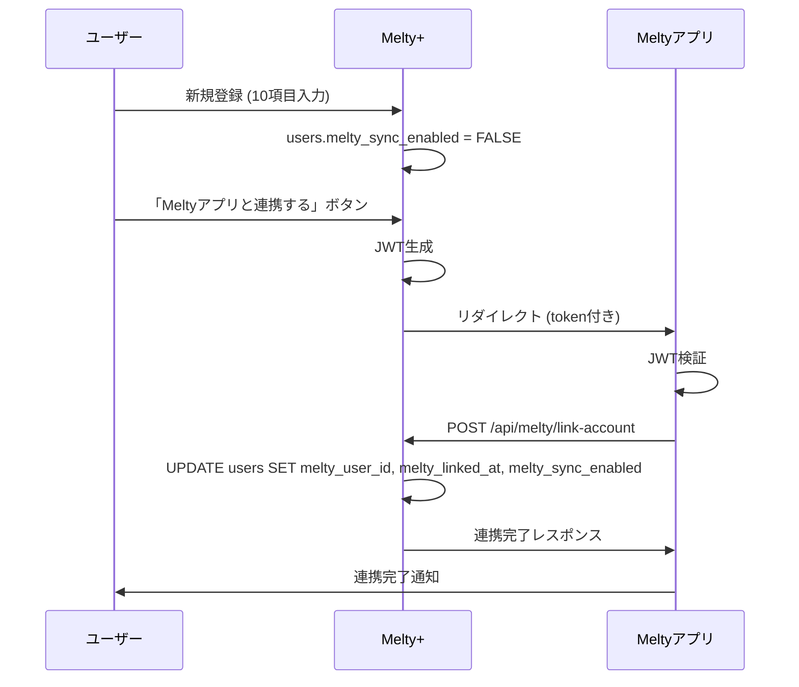
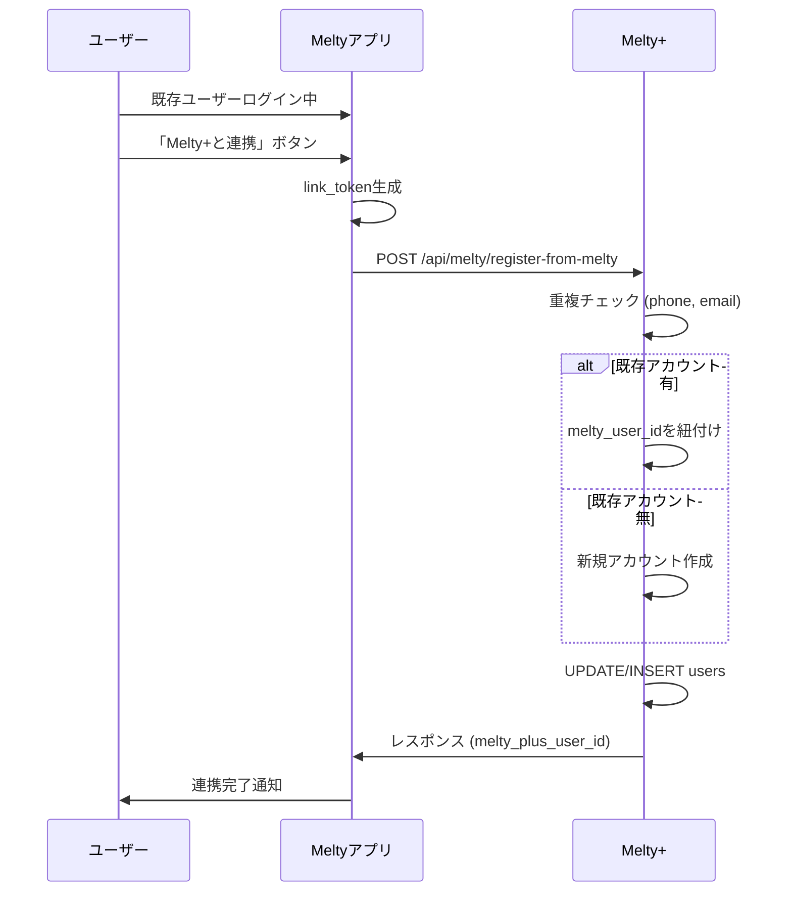

# 📊 Melty+ ⇄ Meltyアプリ 共通アカウント DB仕様書

**作成日**: 2025年10月29日  
**バージョン**: 1.0  
**目的**: Melty+とMeltyアプリで1つのアカウントを共有するためのデータベース設計とAPI仕様

---

## 🎯 概要

### 基本方針

- **認証方式**: JWT (JSON Web Token)
- **同期方式**: リアルタイム双方向同期
- **主キー**: `phone` または `email` (UNIQUE制約)
- **必須項目**: 10項目 (姓名、生年月日、性別、電話、メール、勤務地域、業種、働き方、パスワード)

### アカウント連携パターン

1. **パターンA**: Melty+で先に登録 → Meltyアプリと連携
2. **パターンB**: Meltyアプリで先に登録 → Melty+へ取り込み

---

## 📋 1. データベーステーブル仕様

### 1.1 usersテーブル (メインテーブル)

#### テーブル定義

```sql
CREATE TABLE users (
  -- ============================================
  -- 基本ID情報
  -- ============================================
  id INTEGER PRIMARY KEY AUTOINCREMENT,
  user_id VARCHAR(255) UNIQUE NOT NULL,           -- 内部管理用ID (例: mp_12345)
  
  -- ============================================
  -- ユーザー基本情報 (登録時の10項目)
  -- ============================================
  last_name VARCHAR(100) NOT NULL,                -- 姓
  first_name VARCHAR(100) NOT NULL,               -- 名
  birthday DATE NOT NULL,                         -- 生年月日 (YYYY-MM-DD)
  gender VARCHAR(50) NOT NULL,                    -- 性別: male/female/other/prefer_not_to_say
  phone VARCHAR(20) UNIQUE NOT NULL,              -- 電話番号 (090-1234-5678形式) ★重複不可
  email VARCHAR(255) UNIQUE NOT NULL,             -- メールアドレス ★重複不可
  work_region VARCHAR(100) NOT NULL,              -- 勤務地域 (47都道府県)
  industry VARCHAR(200) NOT NULL,                 -- 業種 (11選択肢)
  employment_type VARCHAR(50) NOT NULL,           -- 働き方: 専業/副業
  password_hash VARCHAR(255) NOT NULL,            -- パスワード (bcrypt/argon2)
  
  -- ============================================
  -- 認証・検証フラグ
  -- ============================================
  email_verified BOOLEAN DEFAULT FALSE,           -- メール認証済みフラグ
  phone_verified BOOLEAN DEFAULT FALSE,           -- SMS認証済みフラグ
  
  -- ============================================
  -- ポイントシステム
  -- ============================================
  current_points INTEGER DEFAULT 500,             -- 現在保有ポイント (初回500pt)
  total_earned_points INTEGER DEFAULT 500,        -- 累計獲得ポイント
  total_used_points INTEGER DEFAULT 0,            -- 累計使用ポイント
  
  -- ============================================
  -- 会員ランク
  -- ============================================
  membership_rank VARCHAR(50) DEFAULT 'bronze',   -- ランク: bronze/silver/gold/platinum
  rank_updated_at TIMESTAMP,                      -- ランク更新日時
  
  -- ============================================
  -- ユーザー設定
  -- ============================================
  subscribe_newsletter BOOLEAN DEFAULT TRUE,      -- メルマガ購読
  allow_notifications BOOLEAN DEFAULT TRUE,       -- プッシュ通知許可
  profile_public BOOLEAN DEFAULT FALSE,           -- プロフィール公開設定
  
  -- ============================================
  -- Meltyアプリ連携情報 ★重要★
  -- ============================================
  melty_user_id VARCHAR(255),                     -- Meltyアプリ側のユーザーID
  melty_linked_at TIMESTAMP,                      -- 連携完了日時
  melty_sync_enabled BOOLEAN DEFAULT FALSE,       -- 同期有効フラグ
  
  -- ============================================
  -- タイムスタンプ
  -- ============================================
  created_at TIMESTAMP DEFAULT CURRENT_TIMESTAMP, -- アカウント作成日時
  updated_at TIMESTAMP DEFAULT CURRENT_TIMESTAMP, -- 最終更新日時
  last_login_at TIMESTAMP,                        -- 最終ログイン日時
  
  -- ============================================
  -- インデックス (検索高速化)
  -- ============================================
  INDEX idx_email (email),
  INDEX idx_phone (phone),
  INDEX idx_melty_user_id (melty_user_id)
);
```

#### フィールド詳細

| カラム名 | データ型 | 制約 | デフォルト値 | 説明 |
|---------|---------|------|------------|------|
| `id` | INTEGER | PRIMARY KEY, AUTO_INCREMENT | - | 内部ID |
| `user_id` | VARCHAR(255) | UNIQUE, NOT NULL | - | 外部公開用ID (mp_12345) |
| `last_name` | VARCHAR(100) | NOT NULL | - | 姓 (例: 田中) |
| `first_name` | VARCHAR(100) | NOT NULL | - | 名 (例: 太郎) |
| `birthday` | DATE | NOT NULL | - | 生年月日 (1995-05-15) |
| `gender` | VARCHAR(50) | NOT NULL | - | male/female/other/prefer_not_to_say |
| `phone` | VARCHAR(20) | UNIQUE, NOT NULL | - | 090-1234-5678 (重複不可) |
| `email` | VARCHAR(255) | UNIQUE, NOT NULL | - | user@example.com (重複不可) |
| `work_region` | VARCHAR(100) | NOT NULL | - | 47都道府県のいずれか |
| `industry` | VARCHAR(200) | NOT NULL | - | 11業種のいずれか |
| `employment_type` | VARCHAR(50) | NOT NULL | - | 専業 or 副業 |
| `password_hash` | VARCHAR(255) | NOT NULL | - | bcrypt/argon2ハッシュ |
| `email_verified` | BOOLEAN | - | FALSE | メール認証済みフラグ |
| `phone_verified` | BOOLEAN | - | FALSE | SMS認証済みフラグ |
| `current_points` | INTEGER | - | 500 | 現在保有ポイント |
| `total_earned_points` | INTEGER | - | 500 | 累計獲得ポイント |
| `total_used_points` | INTEGER | - | 0 | 累計使用ポイント |
| `membership_rank` | VARCHAR(50) | - | 'bronze' | bronze/silver/gold/platinum |
| `rank_updated_at` | TIMESTAMP | - | NULL | ランク更新日時 |
| `subscribe_newsletter` | BOOLEAN | - | TRUE | メルマガ購読 |
| `allow_notifications` | BOOLEAN | - | TRUE | プッシュ通知許可 |
| `profile_public` | BOOLEAN | - | FALSE | プロフィール公開 |
| `melty_user_id` | VARCHAR(255) | - | NULL | Meltyアプリ側のユーザーID |
| `melty_linked_at` | TIMESTAMP | - | NULL | 連携完了日時 |
| `melty_sync_enabled` | BOOLEAN | - | FALSE | 同期有効フラグ |
| `created_at` | TIMESTAMP | - | CURRENT_TIMESTAMP | アカウント作成日時 |
| `updated_at` | TIMESTAMP | - | CURRENT_TIMESTAMP | 最終更新日時 |
| `last_login_at` | TIMESTAMP | - | NULL | 最終ログイン日時 |

---

### 1.2 industriesテーブル (業種マスタ)

#### テーブル定義

```sql
CREATE TABLE industries (
  id INTEGER PRIMARY KEY,
  code VARCHAR(50) UNIQUE NOT NULL,               -- 業種コード (例: nightwork_cabaret)
  name VARCHAR(200) NOT NULL,                     -- 表示名 (例: ナイトワーク(キャバクラ・クラブ等))
  category VARCHAR(100),                          -- カテゴリ (例: nightwork)
  display_order INTEGER                           -- 表示順序
);
```

#### マスタデータ

```sql
INSERT INTO industries (id, code, name, category, display_order) VALUES
(1, 'nightwork_cabaret', 'ナイトワーク(キャバクラ・クラブ等)', 'nightwork', 1),
(2, 'nightwork_girls_bar', 'ナイトワーク(ガールズバー・スナック等)', 'nightwork', 2),
(3, 'nightwork_host', 'ナイトワーク(ホスト・ボーイズバー等)', 'nightwork', 3),
(4, 'nightwork_other', 'ナイトワーク(その他)', 'nightwork', 4),
(5, 'beauty', '美容・エステ・ネイル', 'service', 5),
(6, 'fashion', 'アパレル・ファッション', 'retail', 6),
(7, 'food_service', '飲食・サービス', 'service', 7),
(8, 'office_worker', '会社員・OL', 'office', 8),
(9, 'freelance', '自営業・フリーランス', 'self_employed', 9),
(10, 'student', '学生・アルバイト', 'student', 10),
(11, 'other', 'その他', 'other', 11);
```

#### 業種一覧

| ID | コード | 名称 | カテゴリ |
|----|--------|------|---------|
| 1 | nightwork_cabaret | ナイトワーク(キャバクラ・クラブ等) | nightwork |
| 2 | nightwork_girls_bar | ナイトワーク(ガールズバー・スナック等) | nightwork |
| 3 | nightwork_host | ナイトワーク(ホスト・ボーイズバー等) | nightwork |
| 4 | nightwork_other | ナイトワーク(その他) | nightwork |
| 5 | beauty | 美容・エステ・ネイル | service |
| 6 | fashion | アパレル・ファッション | retail |
| 7 | food_service | 飲食・サービス | service |
| 8 | office_worker | 会社員・OL | office |
| 9 | freelance | 自営業・フリーランス | self_employed |
| 10 | student | 学生・アルバイト | student |
| 11 | other | その他 | other |

---

## 🔄 2. アカウント連携フロー

### 2.1 パターンA: Melty+で先に登録 → Meltyアプリと連携



#### フロー詳細

1. **Melty+で新規登録**
   - ユーザーが10項目を入力
   - `users`テーブルにレコード作成
   - `melty_sync_enabled = FALSE` (連携前)

2. **連携ボタン押下**
   - Melty+プロフィール画面で「Meltyアプリと連携する」
   - Melty+側でJWT生成

3. **Meltyアプリへリダイレクト**
   - URL: `https://melty-app.com/link?token=xxx`
   - JWTペイロード: `{melty_plus_user_id, email, iat, exp}`

4. **Meltyアプリ側で認証**
   - JWTを検証
   - Melty側のユーザーIDを取得

5. **アカウント紐付け**
   - POST `/api/melty/link-account`
   - Melty+で`melty_user_id`を更新
   - `melty_linked_at = NOW()`
   - `melty_sync_enabled = TRUE`

6. **連携完了**
   - 両アプリで同一アカウント利用可能

---

### 2.2 パターンB: Meltyアプリで先に登録 → Melty+へ取り込み



#### フロー詳細

1. **Meltyアプリでログイン中**
   - 既存ユーザーがMeltyアプリを使用中

2. **Melty+連携ボタン**
   - Meltyアプリ内で「Melty+と連携」ボタン押下
   - Melty側で`link_token`生成 (有効期限10分)

3. **Melty+へ登録リクエスト**
   - POST `/api/melty/register-from-melty`
   - ユーザー情報10項目を送信

4. **重複チェック**
   ```sql
   SELECT * FROM users WHERE phone = ? OR email = ?
   ```
   - 既存アカウントがある場合 → `melty_user_id`を紐付け (統合)
   - 既存アカウントがない場合 → 新規作成

5. **アカウント作成または統合**
   - 新規作成の場合: `current_points = 500` (ウェルカムボーナス)
   - 統合の場合: 既存ポイントを保持

6. **レスポンス返却**
   - `melty_plus_user_id`を返却
   - Meltyアプリ側で保存

---

## 🌐 3. API仕様

### 3.1 アカウント連携 (Melty+ → Meltyアプリ)

#### エンドポイント

```
POST /api/melty/link-account
```

#### リクエスト

```http
POST /api/melty/link-account
Content-Type: application/json
Authorization: Bearer {jwt_token}
```

```json
{
  "melty_plus_user_id": "mp_12345",
  "melty_user_id": "melty_67890",
  "link_token": "one_time_token"
}
```

#### レスポンス (成功)

```json
{
  "success": true,
  "linked_at": "2025-10-29T12:00:00Z",
  "message": "アカウント連携が完了しました"
}
```

#### レスポンス (エラー)

```json
{
  "success": false,
  "error": "ALREADY_LINKED",
  "message": "このアカウントは既に連携済みです"
}
```

#### エラーコード

| コード | HTTP Status | 説明 |
|--------|-------------|------|
| `INVALID_TOKEN` | 401 | JWTが無効または期限切れ |
| `ALREADY_LINKED` | 409 | 既に連携済み |
| `USER_NOT_FOUND` | 404 | ユーザーが存在しない |
| `LINK_TOKEN_EXPIRED` | 403 | link_tokenの期限切れ |

---

### 3.2 逆方向連携 (Meltyアプリ → Melty+)

#### エンドポイント

```
POST /api/melty/register-from-melty
```

#### リクエスト

```http
POST /api/melty/register-from-melty
Content-Type: application/json
```

```json
{
  "melty_user_id": "melty_67890",
  "link_token": "eyJhbGciOiJIUzI1NiIsInR5cCI6IkpXVCJ9...",
  "user_data": {
    "last_name": "田中",
    "first_name": "太郎",
    "birthday": "1995-05-15",
    "gender": "male",
    "phone": "09012345678",
    "email": "tanaka@example.com",
    "work_region": "東京都",
    "industry": "ナイトワーク(キャバクラ・クラブ等)",
    "employment_type": "専業"
  },
  "initial_password": "hashed_password_or_plain",
  "sync_enabled": true
}
```

#### リクエストフィールド

| フィールド | 型 | 必須 | 説明 |
|-----------|-----|------|------|
| `melty_user_id` | string | ✅ | Meltyアプリ側のユーザーID |
| `link_token` | string | ✅ | ワンタイム認証トークン (10分有効) |
| `user_data` | object | ✅ | ユーザー基本情報 (10項目) |
| `user_data.last_name` | string | ✅ | 姓 |
| `user_data.first_name` | string | ✅ | 名 |
| `user_data.birthday` | string | ✅ | 生年月日 (YYYY-MM-DD) |
| `user_data.gender` | string | ✅ | male/female/other/prefer_not_to_say |
| `user_data.phone` | string | ✅ | 090-1234-5678 (ハイフン有無可) |
| `user_data.email` | string | ✅ | メールアドレス |
| `user_data.work_region` | string | ✅ | 47都道府県のいずれか |
| `user_data.industry` | string | ✅ | 11業種のいずれか |
| `user_data.employment_type` | string | ✅ | 専業 or 副業 |
| `initial_password` | string | ✅ | パスワード (平文またはハッシュ) |
| `sync_enabled` | boolean | - | 同期有効化 (デフォルト: true) |

#### レスポンス (成功 - 新規作成)

```json
{
  "success": true,
  "melty_plus_user_id": "mp_98765",
  "linked_at": "2025-10-29T12:00:00Z",
  "initial_points": 500,
  "membership_rank": "bronze",
  "message": "Melty+アカウントが作成されました"
}
```

#### レスポンス (成功 - 既存アカウント統合)

```json
{
  "success": true,
  "melty_plus_user_id": "mp_11111",
  "linked_at": "2025-10-29T12:00:00Z",
  "current_points": 1250,
  "membership_rank": "silver",
  "message": "既存のMelty+アカウントと連携しました"
}
```

#### レスポンス (エラー)

```json
{
  "success": false,
  "error": "DUPLICATE_PHONE",
  "message": "この電話番号は既に登録されています",
  "existing_user_id": "mp_11111"
}
```

#### エラーコード

| コード | HTTP Status | 説明 |
|--------|-------------|------|
| `INVALID_TOKEN` | 401 | link_tokenが無効 |
| `TOKEN_EXPIRED` | 403 | link_tokenの期限切れ |
| `DUPLICATE_PHONE` | 409 | 電話番号が既に登録済み |
| `DUPLICATE_EMAIL` | 409 | メールアドレスが既に登録済み |
| `INVALID_INDUSTRY` | 400 | 業種が11選択肢に存在しない |
| `INVALID_REGION` | 400 | 勤務地域が47都道府県に存在しない |
| `VALIDATION_ERROR` | 400 | バリデーションエラー |

---

### 3.3 ユーザー情報同期

#### エンドポイント

```
GET /api/melty/sync-user/{user_id}
```

#### リクエスト

```http
GET /api/melty/sync-user/mp_12345
Authorization: Bearer {jwt_token}
```

#### レスポンス

```json
{
  "user_id": "mp_12345",
  "melty_user_id": "melty_67890",
  "basic_info": {
    "last_name": "田中",
    "first_name": "太郎",
    "birthday": "1995-05-15",
    "gender": "male",
    "phone": "090-1234-5678",
    "email": "tanaka@example.com"
  },
  "business_info": {
    "work_region": "東京都",
    "industry": "ナイトワーク(キャバクラ・クラブ等)",
    "employment_type": "専業"
  },
  "points": {
    "current_points": 1250,
    "total_earned": 1750,
    "total_used": 500
  },
  "membership": {
    "rank": "silver",
    "rank_updated_at": "2025-10-15T10:00:00Z"
  },
  "sync_status": {
    "melty_sync_enabled": true,
    "last_synced_at": "2025-10-29T12:00:00Z"
  }
}
```

---

## 🔐 4. セキュリティ要件

### 4.1 パスワード

#### ハッシュアルゴリズム

- **推奨**: `bcrypt` (cost=10以上)
- **代替**: `argon2` (argon2id推奨)
- **禁止**: 平文保存、MD5、SHA1

#### パスワード要件

- 最低8文字以上
- 英数字混在推奨 (強制ではない)
- パスワード確認フィールド必須

#### ハッシュ例 (bcrypt)

```javascript
const bcrypt = require('bcrypt');
const saltRounds = 10;
const hash = await bcrypt.hash(password, saltRounds);
```

---

### 4.2 JWT認証

#### アルゴリズム

- **HS256** (共通秘密鍵) または **RS256** (公開鍵/秘密鍵)

#### トークン構成

```json
{
  "alg": "HS256",
  "typ": "JWT"
}
{
  "user_id": "mp_12345",
  "melty_user_id": "melty_67890",
  "email": "user@example.com",
  "iat": 1698576000,
  "exp": 1698662400
}
```

#### 有効期限

| トークン種別 | 有効期限 | 用途 |
|------------|---------|------|
| アクセストークン | 24時間 | API認証 |
| リフレッシュトークン | 30日 | トークン更新 |
| link_token | 10分 | アカウント連携 (ワンタイム) |

#### JWT生成例

```javascript
const jwt = require('jsonwebtoken');

const payload = {
  user_id: 'mp_12345',
  melty_user_id: 'melty_67890',
  email: 'user@example.com'
};

const token = jwt.sign(payload, process.env.JWT_SECRET, {
  expiresIn: '24h'
});
```

---

### 4.3 link_token (連携用ワンタイムトークン)

#### 特徴

- **有効期限**: 10分
- **使い捨て**: 1回使用後は無効化
- **検証**: Meltyアプリ側の署名を検証
- **再利用防止**: Redis等でトークン管理

#### 生成例

```javascript
const linkToken = jwt.sign(
  {
    melty_user_id: 'melty_67890',
    purpose: 'account_link'
  },
  process.env.MELTY_SECRET,
  { expiresIn: '10m' }
);
```

---

### 4.4 通信セキュリティ

#### HTTPS必須

- **TLS 1.2**以上
- すべてのAPI通信はHTTPSのみ
- HTTP → HTTPS自動リダイレクト

#### CORS設定

```javascript
// Express例
app.use(cors({
  origin: 'https://melty-app.com',
  credentials: true
}));
```

#### レスポンスヘッダー

```
Access-Control-Allow-Origin: https://melty-app.com
Strict-Transport-Security: max-age=31536000; includeSubDomains
X-Content-Type-Options: nosniff
X-Frame-Options: DENY
```

---

### 4.5 レート制限

#### API制限

| エンドポイント | 制限 | 単位 |
|--------------|------|------|
| `/api/melty/*` | 100リクエスト | /分/IPアドレス |
| `/api/auth/login` | 5回失敗 | ログイン試行 → 10分ロック |
| `/api/auth/register` | 3回 | /時間/IPアドレス |

#### 実装例 (Express)

```javascript
const rateLimit = require('express-rate-limit');

const apiLimiter = rateLimit({
  windowMs: 60 * 1000, // 1分
  max: 100,
  message: 'Too many requests from this IP'
});

app.use('/api/melty/', apiLimiter);
```
---

### 5.1 フォーマット統一

- [ ] **電話番号のフォーマット**
  - 090/080/070で始まる11桁
  - ハイフン有無どちらも許可
  - 正規表現: `/^0[789]0-?\d{4}-?\d{4}$/`

- [ ] **生年月日のフォーマット**
  - YYYY-MM-DD (ISO 8601形式)
  - 例: `1995-05-15`

- [ ] **性別の値**
  - `male` / `female` / `other` / `prefer_not_to_say`

---

### 5.２ 重複処理

- [ ] **重複時の処理方針**
  - 同じ電話番号/メールが既存の場合
    - **Option A**: エラーを返す (重複登録不可)
    - **Option B**: 既存アカウントと連携させる ← **推奨**
    - **Option C**: ユーザーに選択させる

- [ ] **統合時のデータ処理**
  - ポイント: 合算? 既存を保持?
  - ランク: 高い方を採用? 既存を保持?

---

### 5.3 認証・パスワード

- [ ] **パスワード管理**
  - Melty側でパスワード保持している → 同じハッシュを共有?
  - 保持していない → Melty+で初回設定?
  - ハッシュアルゴリズム統一 (bcrypt推奨)

- [ ] **JWT署名鍵の共有**
  - 共通の秘密鍵を使用 (HS256)
  - または公開鍵検証 (RS256)
  - 鍵の安全な受け渡し方法

---

### 5.4 API実装

- [ ] **エンドポイント実装予定**
  - POST `/api/melty/link-account`
  - POST `/api/melty/register-from-melty`
  - GET `/api/melty/sync-user/{user_id}`

- [ ] **レスポンス形式**
  - JSON形式
  - エラーハンドリング (エラーコード統一)

- [ ] **レート制限**
  - 100リクエスト/分 で問題ない?

---

### 5.5 テスト環境

- [ ] **開発環境のURL**
  - Melty+: `https://biid-user.fly.dev/`

- [ ] **テストアカウント**
  - 連携テスト用のダミーアカウント準備

---

## 📝 7. 変更履歴

| 日付 | バージョン | 変更内容 | 担当者 |
|------|----------|---------|--------|
| 2025-10-29 | 1.0 | 初版作成 | Melty+開発チーム |

---